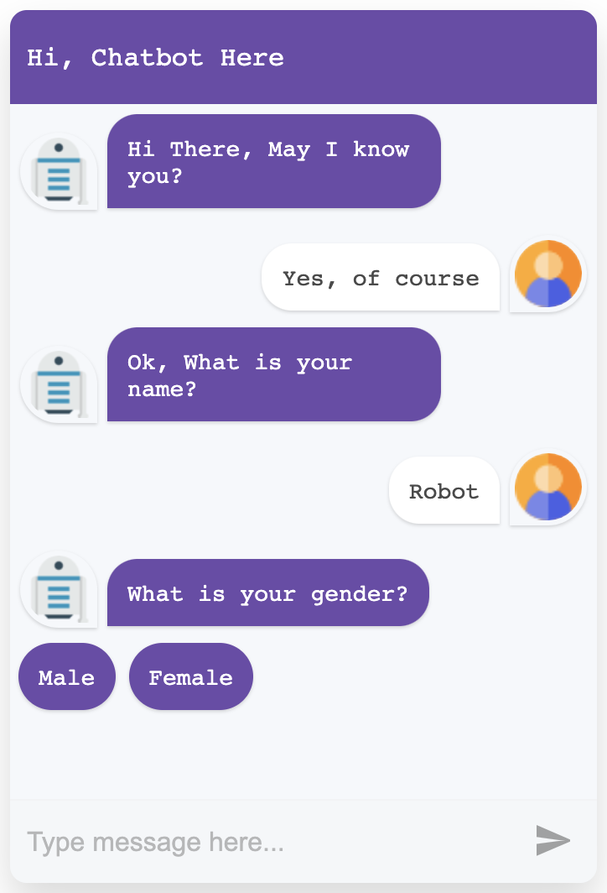

# Vue Simple Chatbot



## Getting Start

```bash
npm install vue-simple-chatbot --save

# or use yarn

yarn add vue-simple-chatbot
```

## Usage

### Import as local component

``` javascript
import VueChatbot from 'vue-simple-chatbot';

export default {
  name: 'App',
  components: {
    VueChatbot
  }
}
```

### Import as global component

``` javascript
import { createApp } from 'vue'
import VueChatbot from 'vue-simple-chatbot';
import App from './App.vue'

const app = createApp(App)

app.use(VueChatbot)

app.mount('#app')

```

### Use the component

``` vue
<template>
   <vue-chatbot :steps="steps">
        <template v-slot:header>
          <div>Hi, Chatbot Here</div>
       </template>
   </vue-chatbot>
</template>

<script>

export default {
    name: 'App',
    data() {
        return {
            steps: [
                {
                    id: '1',
                    hideInput: true,
                    message: 'Hello There...',
                    trigger: '2'
                },
                {
                    id: '2',
                    hideInput: true,
                    options: [
                        { id: '1', label: 'Please try again', trigger: '1' },
                        { id: '2', label: 'I am busy', trigger: '3' },
                        { id: '3', label: 'Ask me phone number', trigger: '4' },
                    ],
                },
                {
                    id: '4',
                    message: 'What is your phone number?',
                    trigger: 'phone',
                },
                {
                    id: 'phone',
                    user: true,
                    validator: (value) => {
                        if (isNaN(value)) {
                            return 'Value should be a number';
                        }
                        return true;
                    },
                    trigger: '3'
                },
                {
                    id: '3',
                    hideInput: true,
                    message: 'Enjoy your activities!',
                    end: true
                },
            ]
        }
    }
}

</script>

```

## Api Reference

### Props

| Name                  | Type     | Default       | Description |
| ---                   | ---      | ---           | ---         |
| `steps`               | Array    | []            | Step by step chat declare here, you can check through this doc [example](example/App.vue) |
| `width`               | String   | '350px'       | Define width of chat |
| `styleConfig`         | Object   | { theme: 'rgb(110, 72, 170)' }       | Set theme color of chat |
| `delay`               | Number   | 1000          | Set delay response chat both user and bot (1000 = 1 second) |
| `botAvatar`           | Image    | [](src/assets/robot.png)        | Set bot image |
| `userAvatar`          | Image    | [](src/assets/user.png)         | Set user image |

## Credit
Inspired by [React Simple Chatbot](https://lucasbassetti.com.br/react-simple-chatbot/)
## License
MIT

